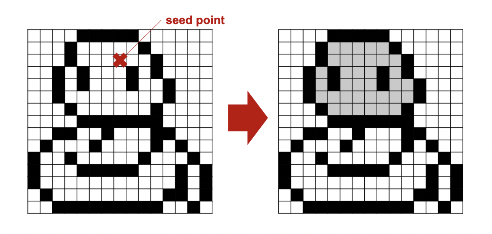

# Bucket Fill Python Coursework

## Context

This is a coursework assignment that I completed as part of my Python module in my MSc Artificial Intelligence. The details of the coursework are described in <em>description.pdf</em>. My contribution consisted in completing the tasks described below. The assignment consisted in implementing a bucket fill functionality to fill a closed boundary of pixels as shown in the image below.



## Usage 

To run the code and test that it works on some test images, run:

```shell
python3 bucket_fill.py
```

## Tasks

- Complete the `fill()` function in [bucket_fill.py](bucket_fill.py)
- Write test cases to make sure that the function works correctly
- Describe your algorithm in a readme.pdf file and submit this separately to CATe (there is no need to commit this file to the repo)

You are encouraged to read the **DocStrings** present in the document.

To test your code you can use the following command:
```shell
python3 bucket_fill.py
```
Example pattern files are available in [data/](data/).
